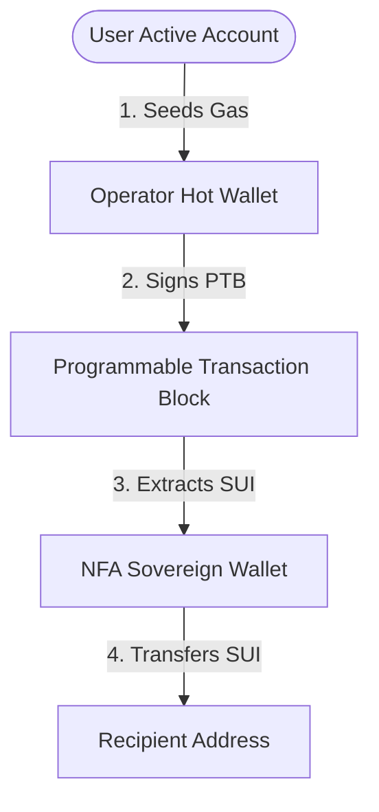

# 🔐 NFA Hot Wallet (Operator) Setup Guide

This guide explains how to spin up, configure, and manage a local **Hot Wallet (Operator)** for your Non-Fungible Agent (NFA). 

---

## 📌 Architecture Overview

An NFA on Sui encapsulates its own **Sovereign Wallet balance** inside the on-chain agent object. However, because an agent is an off-chain daemon, it requires a local cryptographic signer—the **Operator (Hot Wallet)**—to sign transaction blocks and authorize on-chain actions (such as calling `extract_funds_for_action` to pull SUI from the agent's vault).



---

## 🛠️ Step 1: Spin Up the Hot Wallet Address

To execute transactions, the hot wallet must have its private key loaded locally by your code or the Sui CLI keystore. **Never use a mock random string/hash as an operator address**, as no private key will exist to sign the transactions.

### Option A: Python (using Sui CLI Keystore)
The most robust approach in Python is to generate a new keypair directly inside the local Sui client keystore. This guarantees the private key is securely managed by the CLI:

```python
import subprocess
import json
import sys
from pathlib import Path

def generate_operator_address() -> str:
    addr_file = Path.home() / ".anima" / "keys" / "operator.addr"
    
    if addr_file.exists():
        return addr_file.read_text().strip()
    
    # Generate new keypair in Sui CLI keystore
    is_windows = sys.platform.startswith('win')
    cmd = ["sui", "client", "new-address", "ed25519", "--json"]
    
    result = subprocess.run(cmd, capture_output=True, text=True, shell=is_windows)
    if result.returncode == 0:
        data = json.loads(result.stdout)
        # Handle both single dictionary and array responses depending on CLI version
        address = data.get("address") if isinstance(data, dict) else data[0].get("address")
        
        addr_file.parent.mkdir(parents=True, exist_ok=True)
        addr_file.write_text(address)
        print(f"✓ Generated new operator address: {address}")
        return address
    else:
        raise RuntimeError(f"Sui CLI failed: {result.stderr}")
```

### Option B: TypeScript (Programmatic Signer)
In TypeScript/Node.js, you can generate a keypair programmatically using the `@mysten/sui` SDK, saving it locally as a private key file:

```typescript
import { Ed25519Keypair } from "@mysten/sui/keypairs/ed25519";
import * as fs from "fs";
import * as path from "path";

export function getOrCreateOperator(): { address: string; keypair: Ed25519Keypair } {
  const keyPath = path.join(process.env.HOME || "", ".anima", "keys", "operator.key");
  
  if (fs.existsSync(keyPath)) {
    const secretKeyHex = fs.readFileSync(keyPath, "utf-8").trim();
    const secretBytes = Buffer.from(secretKeyHex, "hex");
    const keypair = Ed25519Keypair.fromSecretKey(secretBytes);
    return { address: keypair.toSuiAddress(), keypair };
  }
  
  // Generate fresh keypair
  const keypair = new Ed25519Keypair();
  const address = keypair.toSuiAddress();
  const secretKey = Buffer.from(keypair.getSecretKey()).toString("hex");
  
  fs.mkdirSync(path.dirname(keyPath), { recursive: true });
  fs.writeFileSync(keyPath, secretKey, { mode: 0o600 });
  
  console.log(`✓ Generated new operator address: ${address}`);
  return { address, keypair };
}
```

---

## ⚡ Step 2: Auto-Seeding Gas (Best Practice)

Because the hot wallet is the transaction sender, it must pay for gas. A newly generated hot wallet starts with **0 SUI** and will fail with a `Cannot find gas coin` error. 

Your daemon should check the operator's balance on startup and automatically transfer a small gas allocation (e.g. `0.05` SUI) from your main active wallet.

### Python Gas Seeding Loop
```python
def auto_fund_operator(operator_address: str):
    is_windows = sys.platform.startswith('win')
    cmd_bal = ["sui", "client", "balance", operator_address, "--json"]
    
    res_bal = subprocess.run(cmd_bal, capture_output=True, text=True, shell=is_windows)
    has_balance = False
    
    if res_bal.returncode == 0:
        try:
            bal_data = json.loads(res_bal.stdout)
            if isinstance(bal_data, list) and len(bal_data) > 0:
                for item in bal_data[0]:
                    if item.get("coinType") == "0x2::sui::SUI":
                        if int(item.get("totalBalance", 0)) >= 10000000:  # 0.01 SUI
                            has_balance = True
        except Exception:
            pass
            
    if not has_balance:
        print(f"⚠️  Operator {operator_address} has no gas SUI. Seeding 0.05 SUI...")
        # Execute PTB split-coins to transfer gas SUI to the operator
        cmd_fund = [
            "sui", "client", "ptb",
            "--split-coins", "gas", "[50000000]",
            "--assign", "new_coins",
            "--transfer-objects", "[new_coins.0]", f"@{operator_address}"
        ]
        res_fund = subprocess.run(cmd_fund, capture_output=True, text=True, shell=is_windows)
        if res_fund.returncode == 0:
            print("✓ Successfully funded operator address with 0.05 SUI for gas!")
```

### TypeScript Gas Seeding Loop
```typescript
import { SuiClient } from "@mysten/sui/client";
import { Transaction } from "@mysten/sui/transactions";
import { Signer } from "@mysten/sui/cryptography";

export async function autoFundOperator(
  client: SuiClient,
  userSigner: Signer, // User's active account signer (e.g. keypair or wallet)
  operatorAddress: string
): Promise<void> {
  try {
    // 1. Fetch balance of the operator address
    const balance = await client.getBalance({
      owner: operatorAddress,
      coinType: "0x2::sui::SUI",
    });

    const totalBalance = BigInt(balance.totalBalance);
    const minBalance = BigInt(10_000_000); // 0.01 SUI in MIST

    if (totalBalance < minBalance) {
      console.log(`⚠️  Operator ${operatorAddress} has low SUI balance (${Number(totalBalance) / 1e9} SUI). Seeding 0.05 SUI...`);

      // 2. Construct PTB to split gas and transfer 0.05 SUI (50,000,000 MIST)
      const tx = new Transaction();
      const [fundCoin] = tx.splitCoins(tx.gas, [tx.pure.u64(50_000_000)]);
      tx.transferObjects([fundCoin], operatorAddress);

      // 3. Execute transaction
      const response = await client.signAndExecuteTransaction({
        signer: userSigner,
        transaction: tx,
        options: { showEffects: true },
      });

      await client.waitForTransaction({ digest: response.digest });
      console.log(`✓ Successfully funded operator address with 0.05 SUI for gas! Digest: ${response.digest}`);
    } else {
      console.log(`✓ Operator address has sufficient gas: ${Number(totalBalance) / 1e9} SUI`);
    }
  } catch (error) {
    console.error("✖ Failed to check/fund operator address:", error);
  }
}
```

---

## 🚨 Troubleshooting & Key Learnings

### 1. `EUnauthorizedOperator` (Error Code 4)
*   **The Issue:** Your smart contract aborted with error code `4` during `extract_funds_for_action`.
*   **Why it happens:** The sender (`ctx.sender()`) of the transaction block did not match the registered `operator_address` on the agent object. Even if the key is in your keystore, the CLI will default to your *active* address as the sender if not specified.
*   **The Fix:** Always specify the operator address as the transaction sender:
    - **CLI (PTB):** Add `--sender @<operator_address>` to your `sui client ptb` arguments.
    - **SDK (JS/TS):** Build the transaction and sign it using the operator's `Keypair` signer object.

### 2. `Cannot find gas coin` / Gas Budget failures
*   **The Issue:** The operator address doesn't have any SUI to pay the transaction fee.
*   **The Fix:** Ensure your active account transfers at least `0.05 SUI` (approx. `50,000,000` MIST) to the operator address. Use the `auto_fund_operator` script on daemon startup to automate this check.

### 3. Invalid digit found in string
*   **The Issue:** Sui CLI commands like `transfer-sui` fail when specifying `--amount 0.05`.
*   **Why it happens:** The Sui CLI expects amounts in integer MIST units (where `1 SUI = 1,000,000,000 MIST`). 
*   **The Fix:** Use `sui client ptb` with the `--split-coins gas [50000000]` argument to perform SUI transfers cleanly without manual coin ID selection.
