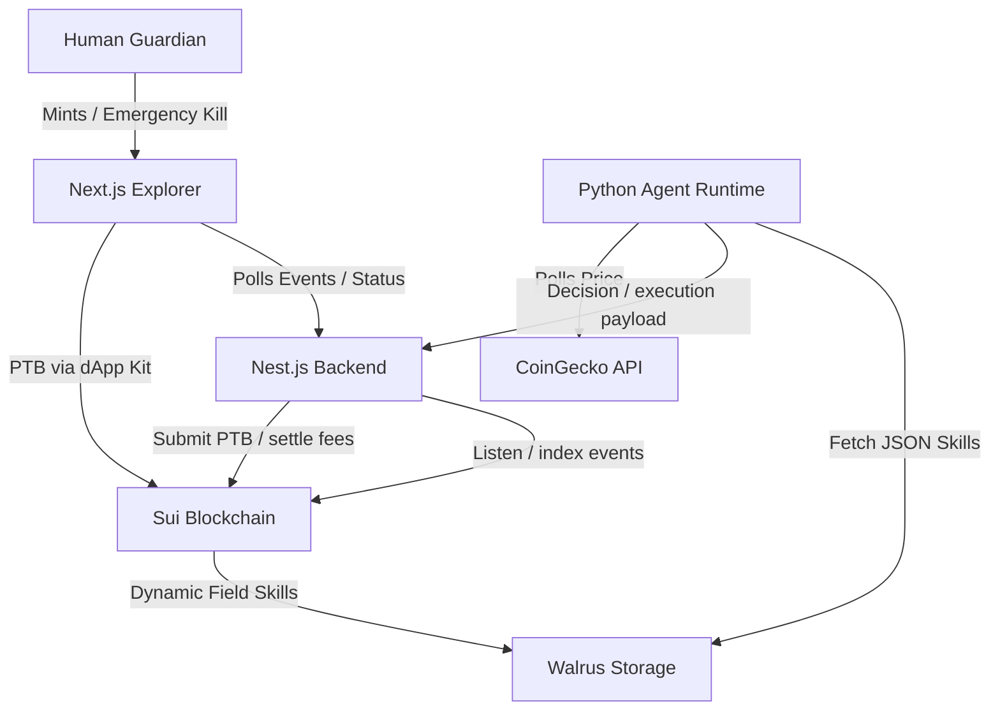

# ANIMA Protocol: Project Analysis & Architecture Overview

This document provides a comprehensive breakdown of the **ANIMA Protocol** (Agent Native Identity & Machine Autonomy) based on an analysis of the existing codebase. 

---

## 1. System Architecture & Component Mapping

The system consists of four main components operating across on-chain (Sui), decentralized storage (Walrus), and off-chain (runtime, backend, frontend) environments.



---

## 2. On-Chain Contracts (`contracts/`)
Located at [contracts/sources](file:///c:/Users/PC/Desktop/Coding/ANIMA-protocol/contracts/sources). Deployed on Sui Testnet under Package ID: `0x5f6681ebeff7b6a1a1f333ba20842d47ed822f39e3ca9d06de3a69f2282e6eca`.

### Core Data Models
*   **`ANIMA`**: The agent's identity object. Tracks state variables:
    *   `name: String`
    *   `reputation_score: u64` (starts at `100` pristine)
    *   `is_paused: bool`
    *   `wallet_balance: Balance<SUI>`
*   **`OwnerCap`**: The guardian's certificate. Required to trigger emergency pauses or edit skills.
*   **`BackendCap`**: Backend-held certificate. Required to trigger compute cost settlements.

### Key Operations & Modules
1.  **`protocol.move`**:
    *   `mint_agent(name)`: Instantiates `ANIMA` and transfers capabilities.
    *   `trigger_emergency_kill(agent, cap)`: Sets `is_paused = true` and drains all vault `SUI` to the guardian wallet.
    *   `settle_compute_costs(agent, backend_cap, amount, recipient)`: Periodic compute cost extraction from the agent balance.
2.  **`wallet.move`**:
    *   `deposit_funds(agent, coin)`: Entry function allowing any source to fund the agent.
    *   `extract_funds_for_action(agent, amount)`: Extracts `Coin<SUI>` to perform operations (e.g. DeepBook swaps). Requires agent to be unpaused.
3.  **`skill_registry.move`**:
    *   Links arbitrary capabilities to the agent via dynamic fields of key `SkillKey { name }` and value `walrus_blob_id` (a `String`).
    *   Operations: `authorize_skill`, `update_skill_manifest`, `revoke_skill`, and `read_skill_blob`.
4.  **`events.move`**:
    *   Emits: `AnimaMinted`, `EmergencyHatchTriggered`, `ComputeSettled`, and `AgentActionExecuted`.

---

## 3. Off-Chain Agent Runtime (`agent-runtime/`)
Located at [agent-runtime/](file:///c:/Users/PC/Desktop/Coding/ANIMA-protocol/agent-runtime). Phase 1 is complete.

### Capabilities & Logic
*   **`monitor.py`**: Runs a continuous polling loop querying token price feeds (e.g., SUI) via CoinGecko's free endpoint.
*   **`walrus_client.py`**: Interacts with the Walrus storage layer (mocked for initial testing).
    *   Handles serializing/deserializing a structured skill configuration:
        ```json
        {
          "skill_name": "token_price_monitor",
          "version": "1.0",
          "trigger": { "type": "price_threshold", "token": "SUI", "condition": "below", "value": 0.4 },
          "action": { "type": "swap", "from_token": "USDC", "to_token": "SUI", "amount_percentage": 10 },
          "risk_limits": { "max_spend_per_action": 10.0, "daily_spend_cap": 50.0 }
        }
        ```
    *   Performs hash-integrity validation on retrieved skills to prevent tampering.

---

## 4. Execution Backend (`backend/`)
Located at [backend/](file:///c:/Users/PC/Desktop/Coding/ANIMA-protocol/backend). Built with Nest.js.

### Components & Modules
*   **`SuiService`**: General read utility wrapping `SuiJsonRpcClient` on testnet.
*   **`PtbService`**:
    *   Hosts the agent signer context initialized via `Ed25519Keypair` using `AGENT_PRIVATE_KEY`.
    *   `buildAndExecutePTB()`: Constructs a Programmable Transaction Block (PTB). It asserts the agent isn't paused, verifies skill authorization via an on-chain move call (`verify_skill_auth`), calls DeepBook or transfers, emits action events, and submits transaction blocks.
*   **`DeepbookService` & `lib/swap.ts`**:
    *   Integrates `@mysten/deepbook-v3` Client.
    *   Supports feature flag `USE_DEEPBOOK_FALLBACK`. If `true`, performs a simple SUI `splitCoins` transfer to represent the swap.
*   **`IndexerService`**:
    *   Listens to Move event updates under module `events`.
    *   Supports both standard WebSocket subscriptions and chronological JSON-RPC polling (`queryEvents`) with cursor advancement.
    *   Normalizes events and inserts them into an in-memory `AgentEvent` registry store (`store.ts`) capped at 100 entries.

---

## 5. UI Explorer (`explorer/`)
Located at [explorer/](file:///c:/Users/PC/Desktop/Coding/ANIMA-protocol/explorer). Built with Next.js (canary/16.2), Tailwind CSS v4, and Lucide React.

### Current Implementation State
*   `app/page.tsx` (Home page) is functional. Renders:
    *   WebGL animated noise-gradient header (`Grainient.tsx`).
    *   Top-level stats cards (Tx blocks, Staking APY, Epoch metrics).
*   `app/layout.tsx` binds open sans & DM sans typography variables.
*   `globals.css` declares colors, layout utilities, custom webkit scrollbar rules, and premium glassmorphism classes (`glass-card`).

### Remaining Features to Build (per plan)
*   **Mint Page (`app/mint/page.tsx`)**: Input form to trigger agent instantiation via Move contracts and output the generated `ANIMA` and `OwnerCap` object IDs.
*   **Agent Profile Dashboard (`app/agents/[id]/page.tsx`)**:
    *   Header displaying agent status (pulsing badge `ACTIVE` / static `PAUSED`).
    *   Reputation metrics, owner address links, and wallet balance.
    *   Fund modal to allow the guardian to transfer SUI tokens.
    *   Skill list reading dynamically from Walrus.
    *   Action Feed subscribing/polling backend `/agent/:id/events` to render a live ledger of agent transactions.
    *   Kill Switch: Emergency action button (visible only if connected wallet holds the `OwnerCap` object) to run the `trigger_emergency_kill` transaction.
